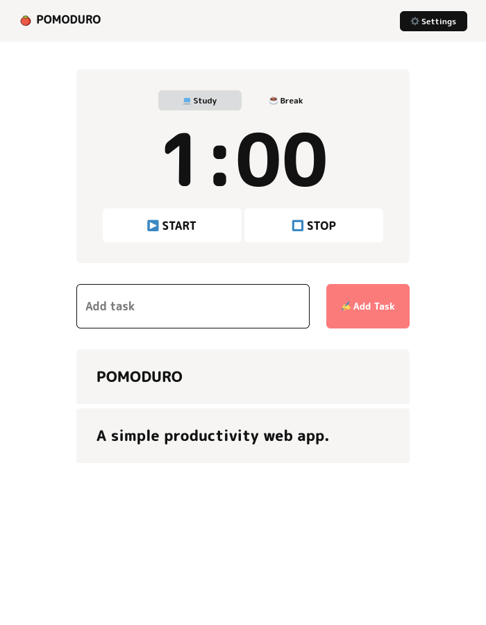

    
    <h1>POMODURO</h1>
    
A simple productivity web app.

        &#x1F468;&#x200D;&#x1F4BB; with &#x1F90D; for &#x1F41D;
        
    

        
        
        
        
        
        
    

## Contents

-   [About](#contents)
-   [Documentation](#documentation)
-   [License](#license)
-   [Credits](#credits)

### About

A simple productivity web app.

POMODURO (Plan, Organize, Manage, Oversee, Delegate, Unique, Rest, On-time)

[Try POMODURO now, it's live!](https://pomoduro.vercel.app/)

> [!NOTE]
> POMODURO is not a spelling mistake, it is intentionally named as it is.

### Documentation

Read the documentation [here](./DOCS.md).

### License

POMODURO, the Wep App and the source code, is provided under the [MIT License](./LICENSE).

&copy; 2022 - 2023 egargo

### Credits

-   Audio
    -   [Popcorn](https://www.zedge.net/ringtone/ed961a26-834d-4c90-b989-3e58f3b6de65)
-   Fonts
    -   [M PLUS Rounded 1c](https://fonts.google.com/specimen/M+PLUS+Rounded+1c/about?query=M+Plus+Rounded) under the [Open Font License](https://scripts.sil.org/cms/scripts/page.php?site_id=nrsi&id=OFL).
-   Icons
    -   [OpenMoji](https://github.com/hfg-gmuend/openmoji) under the [CC-BY-SA-4.0 license](https://github.com/hfg-gmuend/openmoji/blob/master/LICENSE.txt)
