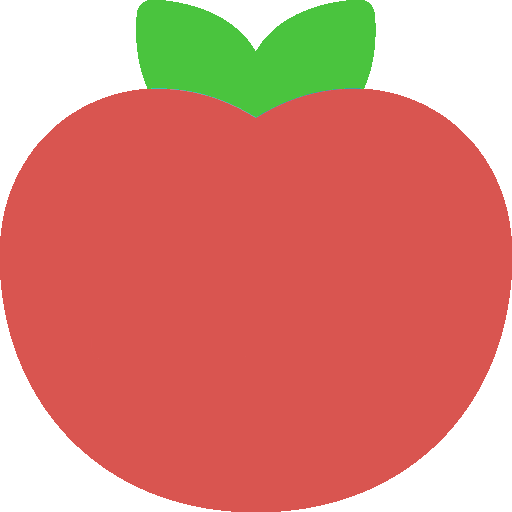

    <h1>POMODURO</h1>
    
A simple productivity tool.

    
    

        
        
        
        
        
        
    

## Contents

-   [About](#about)
-   [Features](#features)
-   [License](#license)
    -   [POMODURO](#pomoduro)
    -   [Resources](#resources)

### About

POMODURO (Plan, Organize, Manage, Oversee, Delegate, Unique, Rest, On-time)

&#x1F468;&#x200D;&#x1F4BB; with &#x1F90D; for &#x1F41D;

### Features

-   [x] Easy to use
-   [x] Pomodoro
    -   [x] Start
    -   [x] Pause
    -   [x] Stop
-   [x] Work/Study switch
    -   [x] Work
    -   [x] Study
-   [x] To do list
    -   [x] Add new task
    -   [x] Display tasks
    -   [x] Delete task
-   [x] Settings
    -   [x] Set study time
    -   [x] Set break time
    -   [x] Save Pomodoro settings
    -   [x] Reset To do list
    -   [x] Reset Pomodoro settings
-   [x] Notifications
    -   [x] Start notification
    -   [x] End notification
    -   [x] Alarm tone
-   [x] Progressive Web App (PWA) support
-   [x] Responsive design

#### To do

_Note_: The current implementation of the To do list feature does not have the capabilities mentioned below, it only hides the task that's been clicked (marked as done).

-   [ ] Add more features to To do list
    -   [ ] Check button to mark task as done
    -   [ ] X button to delete task

##### Bugs

_Note_: Checked items are fixed bugs.

-   [x] The settings needs to be clicked twice on every first load
-   [x] The web app needs to reload every time a task has been added/deleted
-   [ ] Start button does not work on mobile devices running Chromium-based browsers
    -   [ ] Play/Pause button

#### Technologies used

##### Programming Language

-   CSS 3
-   HTML 5
-   JavaScript ES6

##### Other Tools

-   Git
-   GitHub
-   GitHub Pages
-   VS Code (Vim + Live Server + Prettier)

### License

#### POMODURO

POMODURO, the Wep App and the source code, is provided under the [MIT License](./LICENSE).

#### Resources

-   Audio
    -   [Three-Note Doorbell or Notification](https://freesound.org/people/eqylizer/sounds/624599) under [the Creative Commons 0 License](https://creativecommons.org/publicdomain/zero/1.0).
-   Fonts
    -   [M PLUS Rounded 1c](https://fonts.google.com/specimen/M+PLUS+Rounded+1c/about?query=M+Plus+Rounded) under the [Open Font License](https://scripts.sil.org/cms/scripts/page.php?site_id=nrsi&id=OFL).
